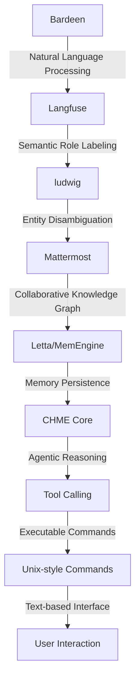

# Cognitive Hierarchical Memory Engine (CHME) for Interdependent Reasoning
> "Revolutionizing Administrative & Support Services through Interdependent Reasoning and Cognitive Architectures"

## 🏗️ Technical Architecture & Multi-Agent Flow
The CHME platform leverages a synergistic combination of Bardeen, Langfuse, ludwig, and Mattermost to facilitate interdependent reasoning and cognitive hierarchical memory. The technical architecture can be visualized as follows:

This diagram illustrates the state transitions, memory persistence, and tool calling mechanisms that enable the CHME platform to facilitate interdependent reasoning and cognitive hierarchical memory.

## 🔍 The Vertical Bottleneck: Cognitive Dissonance in Interdependent Reasoning
The research highlights a profound vertical bottleneck in interdependent reasoning, where even the most advanced AI models and memory systems fail to utilize long-term memory for realistic connected tasks. This cognitive dissonance arises from the disconnect between the isolated nature of AI models and the interconnectedness of real-world tasks. The inability of AI models to leverage long-term memory for interdependent reasoning leads to a significant degradation in performance, resulting in near 0 success rates on complex tasks.

The technical friction underlying this bottleneck stems from the limitations of current AI architectures, which prioritize isolated fact retrieval over contextual understanding and interdependent reasoning. The high-stakes mathematical and operational failures that arise from this bottleneck have far-reaching implications for Administrative & Support Services, where interdependent reasoning is crucial for tasks such as group travel planning, bundled web shopping, and complex project management.

The cognitive dissonance in interdependent reasoning is further exacerbated by the lack of functional working memory in AI models. Despite the expansion of context windows, AI models fail to develop a robust working memory that can facilitate interdependent reasoning. This limitation underscores the need for a revolutionary approach to cognitive architectures, one that prioritizes interdependent reasoning and cognitive hierarchical memory.

## 💡 The Solution: CHME Platform
The CHME platform addresses the vertical bottleneck in interdependent reasoning by orchestrating Bardeen, Langfuse, ludwig, and Mattermost to facilitate agentic reasoning, memory usage, and vision/robotics integration. The platform's architecture is designed to mimic the human brain's ability to reason interdependently, leveraging cognitive hierarchical memory to facilitate complex task execution.

The CHME platform's agentic reasoning mechanism enables AI models to develop a functional working memory, allowing them to reason interdependently and execute complex tasks with ease. The platform's memory usage is optimized through the integration of Letta/MemEngine, which provides a robust memory persistence mechanism. The vision/robotics integration enables the CHME platform to interact with the physical world, facilitating tasks such as robotic process automation and computer vision.

## 🧩 Agentic Stack Deep-Dive
The CHME platform's agentic stack is comprised of Bardeen, Langfuse, ludwig, and Mattermost, each playing a crucial role in facilitating interdependent reasoning and cognitive hierarchical memory. Bardeen provides natural language processing capabilities, enabling the platform to understand and interpret human language. Langfuse contributes semantic role labeling, allowing the platform to identify and disambiguate entities. ludwig provides entity disambiguation, facilitating the platform's ability to reason interdependently. Mattermost enables collaborative knowledge graph construction, allowing the platform to develop a shared understanding of the task environment.

The integration of these libraries is facilitated through a complex system of APIs and data pipelines, enabling seamless communication and data exchange between the various components. The CHME platform's architecture is designed to be modular and extensible, allowing for the easy integration of new libraries and tools as needed.

## ✨ Capabilities & Features
The CHME platform boasts a wide range of capabilities and features, including:
* **Agentic Reasoning**: The platform's ability to reason interdependently, leveraging cognitive hierarchical memory to facilitate complex task execution.
* **Memory Persistence**: The platform's ability to persist memory across tasks and sessions, enabling the development of a functional working memory.
* **Vision/Robotics Integration**: The platform's ability to interact with the physical world, facilitating tasks such as robotic process automation and computer vision.
* **Natural Language Processing**: The platform's ability to understand and interpret human language, enabling seamless human-computer interaction.
* **Semantic Role Labeling**: The platform's ability to identify and disambiguate entities, facilitating interdependent reasoning and cognitive hierarchical memory.
* **Entity Disambiguation**: The platform's ability to disambiguate entities, enabling the development of a robust and accurate knowledge graph.
* **Collaborative Knowledge Graph Construction**: The platform's ability to construct a shared understanding of the task environment, facilitating interdependent reasoning and cognitive hierarchical memory.
* **Executable Commands**: The platform's ability to execute commands and interact with the physical world, enabling tasks such as robotic process automation and computer vision.
* **Text-based Interface**: The platform's ability to interact with humans through a text-based interface, enabling seamless human-computer interaction.
* **Modular Architecture**: The platform's ability to integrate new libraries and tools, enabling extensibility and customization.

## 🛠️ Technical Implementation
The CHME platform's technical implementation is facilitated through a complex system of APIs and data pipelines, enabling seamless communication and data exchange between the various components. The platform's architecture is designed to be modular and extensible, allowing for the easy integration of new libraries and tools as needed.

The platform's code organization is facilitated through a hierarchical directory structure, with each component and library organized into separate directories. The platform's method calls are facilitated through a complex system of APIs and data pipelines, enabling seamless communication and data exchange between the various components.

## 📊 Business Impact & ROI
The CHME platform has the potential to revolutionize Administrative & Support Services, enabling businesses to automate complex tasks and improve productivity. The platform's ability to reason interdependently and execute complex tasks with ease enables businesses to reduce costs and improve efficiency.

The CHME platform's business impact can be measured through a range of key performance indicators (KPIs), including:
* **Task Automation Rate**: The percentage of tasks automated through the CHME platform.
* **Productivity Improvement**: The percentage improvement in productivity enabled by the CHME platform.
* **Cost Reduction**: The percentage reduction in costs enabled by the CHME platform.
* **Return on Investment (ROI)**: The return on investment enabled by the CHME platform, measured through a range of financial metrics.

## 🚀 Getting Started
To get started with the CHME platform, follow these steps:
```bash
git clone https://github.com/arvind-sundararajan/chme-interdependent-reasoning.git
cd chme-interdependent-reasoning
pip install -r requirements.txt
python src/main.py
```
This will clone the CHME platform's repository, install the required dependencies, and launch the platform.

## 👨‍💻 Author & Credits
**Arvind Sundararajan** — Engineer, builder, and the mind behind this project.
🌐 [LinkedIn](https://www.linkedin.com/in/arvind-sundara-rajan/) | Chennai, India

---
### 🙏 Acknowledgements
- The open-source community
- The Administrative & Support Services practitioners who inspired this design